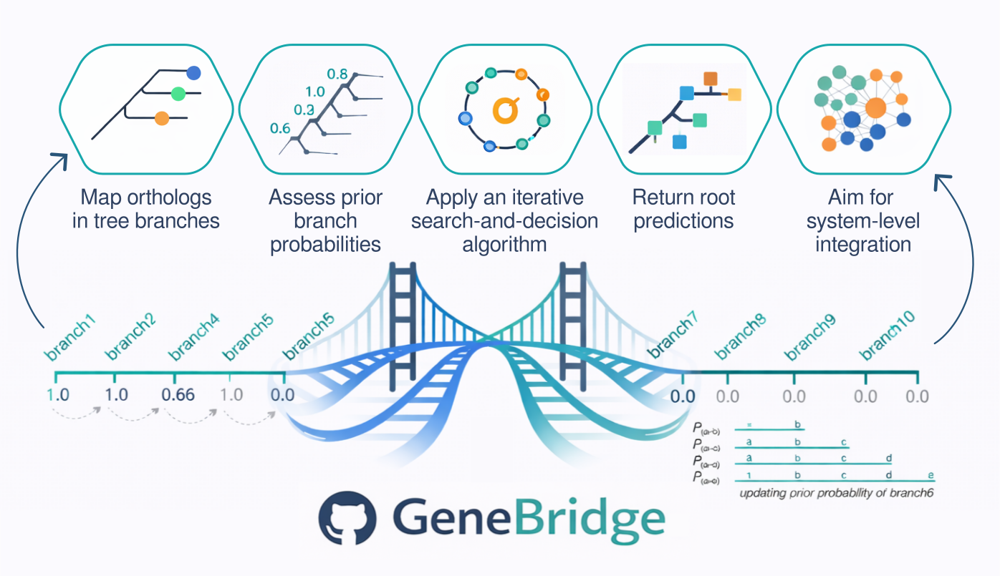

### GeneBridge: Rooting Orthologous Genes in Large-Scale Evolutionary Analysis.
  <!-- badges: start -->
  [](https://lifecycle.r-lib.org/articles/stages.html#stable)
  [](https://cran.r-project.org/web/licenses/Artistic-2.0)
  <!-- badges: end -->

*GeneBridge* is an *R* package designed to assess the evolutionary history of genes across species. It implements the Bridge algorithm to infer the evolutionary root of genes in a given species tree. By rooting orthologous genes in large-scale evolutionary snalysis, *GeneBridge* can provide a framework for exploring evolutionary roots within biological systems.

### Installation in R (>=4.3)

##### Install dependencies to build the package's vignettes

```r
install.packages("knitr")
install.packages("rmarkdown")
```

##### Install the GeneBridge package

```r
install.packages("remotes")
remotes::install_github("sysbiolab/GeneBridge", build_vignettes=TRUE)
```

### Examples

Follow the *GeneBridge* vignette and try to make some *plots*!

```r
library(GeneBridge)
vignette("GeneBridge")
```

### Citation

If you use *GeneBridge*, please cite:

* Campos *et al.* Bridge: A New Algorithm for Rooting Orthologous Genes in Large-Scale Evolutionary Analyses. *Molecular Biology and Evolution* 41(2):msae019, 2024. https://doi.org/10.1093/molbev/msae019

### Licenses

The *GeneBridge* package is distributed under [Artistic-2.0](https://www.r-project.org/Licenses/Artistic-2.0)
