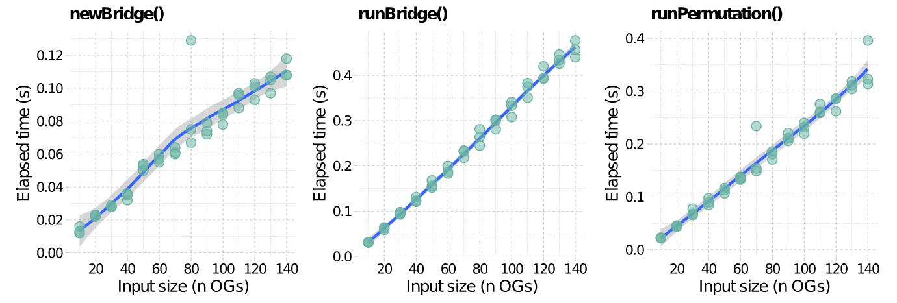

# Overview

In order to interrogate the evolutionary root of a given gene, *GeneBridge* implements a new algorithm called *Bridge*, which assesses the probability that an ortholog is present in each Last Common Ancestor (LCA) of a species in a given species tree. The method is designed to deal with large-scale queries in order to interrogate, for example, all genes annotated in a network (please refer to @Castro2008 for additional examples).

To illustrate the rooting inference consider the evolutionary scenarios presented in **Figure 1** for two hypothetical orthologous groups (OGs). These OGs comprise a number of orthologous genes distributed among 13 species, and the pattern of presence or absence is indicated by green and grey colours, respectively. Observe that in **Figure 1a** at least one ortholog is present in all extant species. To explain this common genetic trait, a possible evolutionary scenario could assume that the ortholog was present in the LCA of all extant species and was genetically transmitted up to the descendants. For this scenario, the evolutionary root might be placed at the bottom of the species tree (i.e. node *j*). A similar interpretation could be done for the hypothetical OG in **Figure 1b**, but with the evolutionary root placed at node *f*. The *Bridge* algorithm infers the most consistent rooting scenario for the observed orthologs in a given species tree, computing a consistency score called *Dscore* and an associated empirical *p-value*. The *Dscore* is an estimate of the stability of the inferred roots and the empirical *p-value* is computed by permutation analysis.

```{r fig1, echo=FALSE, fig.cap="Evolutionary rooting scenarios for two hypothetical orthologous genes in a given species tree. (**a**) Hypothetical OG observed in all species of the tree, without apparent deletions or duplications. (**b**) Hypothetical OG observed in many species, but not all. Numbers in parentheses represent the orthologous genes in each species. Red circles indicate the evolutionary roots that best explain the observed orthologs in the species tree.", out.width = '80%'}
knitr::include_graphics("Fig1.png")
```


# Quick start

We will use the `cogData` dataset available from the *GeneBridge* package to demonstrate the analysis workflow. This dataset includes four objects containing orthology annotation derived from the *STRING database*, release 9.1. The `cogData` dataset should be used for demonstration purposes only as it represents a subset of the STRING database. *GeneBridge* can use other sources of orthology information, provided that the input data is set according to the `cogData` dataset.

```{r}
library(GeneBridge)
data("cogData")
```

## Evolutionary rooting

The rooting analysis starts by running the `newBridge()` function, which will check the consistency of the input data. The user should provide **1**) a `cogdata` object, **2**) a `phyloTree` object, and **3**) set a reference species for which the evolutionary root of its genes will be inferred. Next, the `runBridge()` function will run the *Bridge* algorithm. The results are then retrieved by `getBridge()` function. The pipeline returns the inferred root of each OG evaluated by the *Bridge* algorithm, including the *Dscore* and the associated empirical *p-value*. Additionally, the `plotBridge()` function allows the visualization of the inferred roots (e.g. **Figure 2**) and the LCAs of the reference species (e.g. **Figure 3**).

1 - Create an object of class `Bridge`.
```{r, eval=TRUE}
gbr <- newBridge(cogdata=cogdata, phyloTree=phyloTree, spid="9606", verbose=FALSE)
```

2 - Run the `runBridge()` function.
```{r, eval=TRUE}
set.seed(1)
gbr <- runBridge(gbr, nPermutations=100, verbose=FALSE)
# Note: 'nPermutations' is set to 100 for demonstration purposes; 
# otherwise, set 'nPermutations' >=1000
```

3 - Get results.
```{r, eval=TRUE}
res <- getBridge(gbr, what = "results")
head(res)
```

4 - Check the inferred root of a given OG.
```{r label='plotBridge1', eval=TRUE}
plotBridge(gbr, whichOG="NOG40170")
```

```{r fig2, echo=FALSE, fig.cap="Inferred evolutionary rooting scenario for NOG40170. Monophyletic groups are ordered to show all branches of the tree below the queried species in the analysis.", out.width = '50%'}
knitr::include_graphics("Fig2.png")
```

5 - Visualize the LCAs of the reference species in the analysis.
```{r, eval=TRUE}
plotBridge(gbr, plot.lcas = TRUE)
```

```{r fig3, echo=FALSE, fig.cap="LCAs of the reference species in the analysis.", out.width = '50%'}
knitr::include_graphics("Fig3.png")
```

# High-throughput inference

This example shows how to assess all OGs annotated for *H. sapiens* in the
`r BiocStyle::Biocpkg("geneplast.data.string.v91")` package.

1 - Load orthogy data from the *geneplast.data.string.v91* package.

```{r, eval=FALSE}
# BiocManager::install("geneplast.data.string.v91")
library(geneplast.data.string.v91)
data(gpdata_string_v91)
```

2 - Create an object of class `Bridge` for a reference `spid`.

```{r, eval=FALSE}
gbr <- newBridge(cogdata=cogdata, phyloTree=phyloTree, spid="9606")
```

3 - Run the `runBridge()` function and infer the evolutionary roots. 
*Note: This step may require a significant processing time due to the large number of OGs in the input data (`nPermutations` argument is set to 100 for demonstration purpose only).*

```{r, eval=FALSE}
gbr <- runBridge(gbr, nPermutations=100, verbose=TRUE)
res <- getBridge(gbr, what="results")
head(res)
```

# Runtime performance

```{r label='runtime', eval=FALSE}
#--- Load ggplot
library(ggplot2)
library(ggthemes)
library(egg)
library(data.table)

#--- Load cogdata
data(cogData)

#--- Get "OGs" that include a ref. species (e.g. "9606")
cogids <- unique(cogdata$cog_id[cogdata$ssp_id=="9606"])
length(cogids)
# [1] 142

#--- Make a function to check runtime for different input sizes
check.rooting.runtime <- function(n){
  cogids.subset <- cogids[1:n]
  cogdata.subset <- cogdata[cogdata$cog_id%in%cogids.subset,]
  rt1 <- system.time(
    gbr <- newBridge(cogdata=cogdata.subset, phyloTree=phyloTree, 
      spid="9606", verbose=FALSE)
  )["elapsed"]
  rt2 <- system.time(
    gbr <- runBridge(gbr, nPermutations=100, verbose=FALSE)
  )["elapsed"]
  rtime <- c(rt1,rt2)
  names(rtime) <- c("runtime.preprocess","runtime.bridge")
  return(rtime)
}
# check.rooting.runtime(n=5)

#--- Run check.rooting.runtime() for different input sizes (x3 iterations)
input_size <- seq.int(10,length(cogids),10)
iterations <- 1:3
elapsed_lt <- lapply(iterations, function(i){
  print(paste0("Iteration ",i))
  it <- sapply(input_size, function(n){
    print(paste0("- size...",n))
    check.rooting.runtime(n)
  })
})

#--- Get 'preprocess' runtime
runtime.preprocess <- sapply(elapsed_lt, function(lt){
  lt["runtime.preprocess",]
})
runtime.preprocess <- data.frame(InputSize=input_size, runtime.preprocess)
runtime.preprocess <- melt(as.data.table(runtime.preprocess), "InputSize")
colnames(runtime.preprocess) <- c("Input.Size","Iteration","Elapsed.Time")

#--- Get 'Bridge' runtime
runtime.bridge <- sapply(elapsed_lt, function(lt){
  lt["runtime.bridge",]
})
runtime.bridge <- data.frame(InputSize=input_size, runtime.bridge)
runtime.bridge <- melt(as.data.table(runtime.bridge), "InputSize")
colnames(runtime.bridge) <- c("Input.Size","Iteration","Elapsed.Time")

#--- Plot runtime results
cls <- c("#69b3a2",adjustcolor("#69b3a2", alpha=0.5))
gg1 <- ggplot(runtime.preprocess, aes(x=Input.Size, y=Elapsed.Time)) +
  geom_smooth(method=loess, se=TRUE) +
  geom_point(color=cls[1], fill=cls[2], size=3, shape=21) +
  scale_x_continuous(breaks=pretty(runtime.preprocess$Input.Size)) +
  scale_y_continuous(breaks=pretty(runtime.preprocess$Elapsed.Time)) +
  theme_pander() + labs(title="newBridge()") +
  xlab("Input size (n)") + ylab("Elapsed time (s)") +
  theme(aspect.ratio=1, plot.title=element_text(size=12))
gg2 <- ggplot(runtime.bridge, aes(x=Input.Size, y=Elapsed.Time)) +
  geom_smooth(method=loess, se=TRUE) +
  geom_point(color=cls[1], fill=cls[2], size=3, shape=21) +
  scale_x_continuous(breaks=pretty(runtime.bridge$Input.Size)) +
  scale_y_continuous(breaks=pretty(runtime.bridge$Elapsed.Time)) +
  theme_pander() + labs(title="runBridge()") +
  xlab("Input size (n)") + ylab("Elapsed time (s)") +
  theme(aspect.ratio=1, plot.title=element_text(size=12))
grid.arrange(gg1, gg2, nrow = 1)
pdf(file = "rooting_runtime.pdf", width = 7, height = 3)
grid.arrange(gg1, gg2, nrow = 1)
dev.off()
```

```{r fig4, echo=FALSE, fig.cap="Runtime performance of the rooting pipeline. Each point indicate the elapsed time to evaluate the 'check.rooting.runtime()' function, which assesses the execution time of the *newBridge()* and *runBridge()* functions separatelly.", out.width = '100%'}

```


# Orthology data packages

The `r BiocStyle::Biocpkg("geneplast.data")` package provides supporting data via `r BiocStyle::Biocpkg("AnnotationHub")` for the *Geneplast* evolutionary analyses. The `r BiocStyle::Biocpkg("geneplast.data")` package contains pre-processed data from different OG databases for use in the *Geneplast* package. In the current version, `r BiocStyle::Biocpkg("geneplast.data")` provides orthology information from STRING (https://string-db.org/), OMA Browser (https://omabrowser.org/), and OrthoDB (https://www.orthodb.org/).

# Session information

```{r label='Session information', eval=TRUE, echo=FALSE}
sessionInfo()
```

# References
