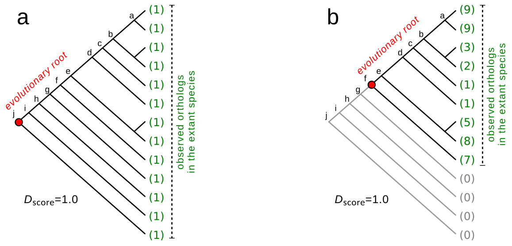
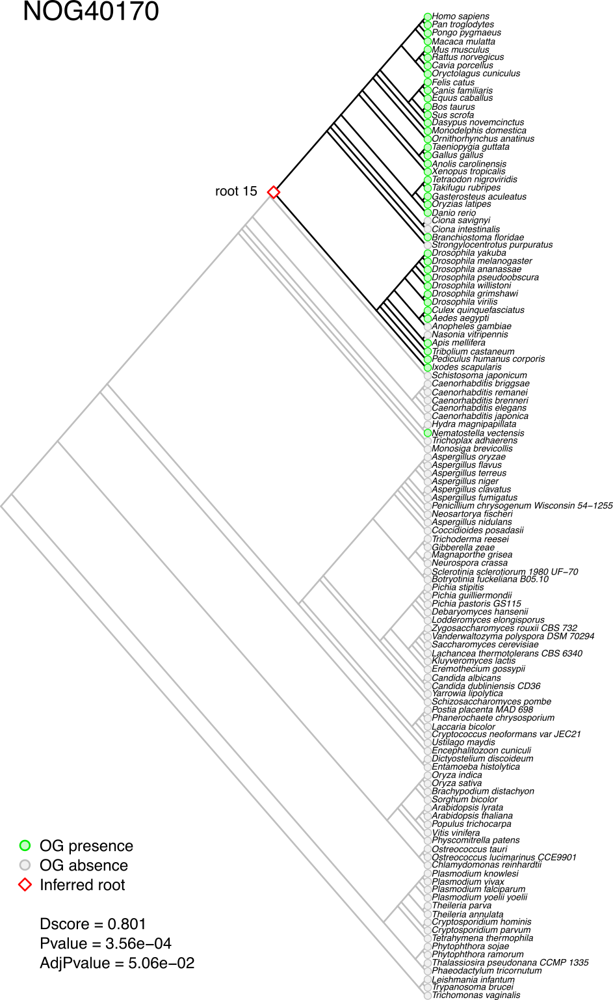
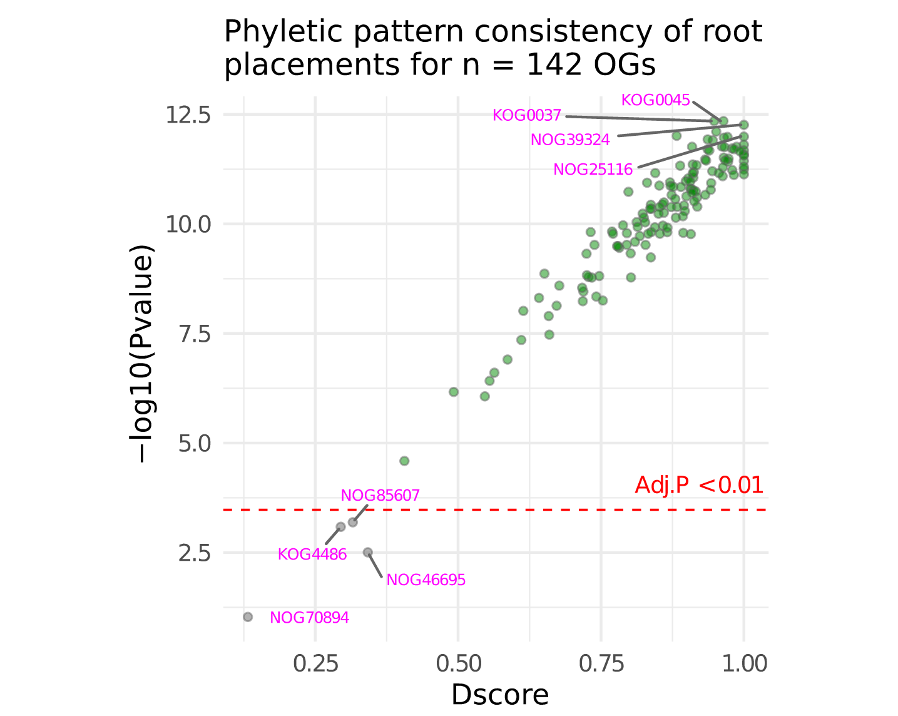
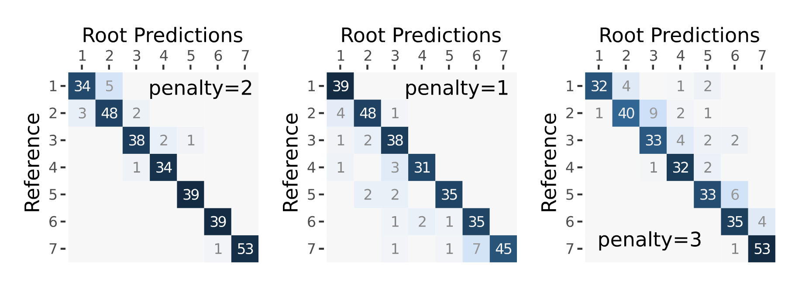

**Package**: GeneBridge `r packageVersion('GeneBridge')`

# Highlights
* Implements the Bridge algorithm for evolutionary root inference
* Quantifies rooting stability through empirical permutation testing
* Provides a framework for system-level evolutionary analysis

# Overview

In order to interrogate the evolutionary root of a given gene, *GeneBridge* implements the *Bridge* algorithm [@Campos2024], which assesses the probability that an ortholog is present in each Last Common Ancestor (LCA) of a species in a given species tree. The method is designed to deal with large-scale queries in order to interrogate, for example, all genes annotated in a network (please refer to @Campos2024 and @Castro2008 for additional examples).

To illustrate the rooting inference consider the evolutionary scenarios presented in **Figure 1** for two hypothetical orthologous groups (OGs). These OGs comprise a number of orthologous genes distributed among 13 species, and the pattern of presence or absence is indicated by green and grey colours, respectively. Observe that in **Figure 1a** at least one ortholog is present in all extant species. To explain this common genetic trait, a possible evolutionary scenario could assume that the ortholog was present in the LCA of all extant species and was genetically transmitted up to the descendants. For this scenario, the evolutionary root might be placed at the bottom of the species tree (i.e. node *j*). A similar interpretation could be done for the hypothetical OG in **Figure 1b**, but with the evolutionary root placed at node *f*. The *Bridge* algorithm infers the most consistent rooting scenario for the observed orthologs in a given species tree, computing a consistency score called *Dscore* and an associated empirical *p-value*. The *Dscore* is an estimate of the stability of the inferred roots and the empirical *p-value* is computed by permutation analysis.

```{r fig1, echo=FALSE, fig.cap="Evolutionary rooting scenarios for two hypothetical orthologous genes in a given species tree. (**a**) Hypothetical OG observed in all species of the tree, without apparent deletions or duplications. (**b**) Hypothetical OG observed in many species, but not all. Numbers in parentheses represent the orthologous genes in each species. Red circles indicate the evolutionary roots that best explain the observed orthologs in the species tree.", out.width = '90%'}

```


# Quick start

We will use the `gene_bridge_data` available from the *GeneBridge* package to demonstrate the analysis workflow. This dataset includes four objects containing orthology annotation derived from the *STRING database*, release 9.1. The `gene_bridge_data` data should be used for demonstration purposes only as it represents a subset of the STRING database. *GeneBridge* can use other sources of orthology information, provided that the input data is set according to the `gene_bridge_data` dataset.

```{r}
library(GeneBridge)
data("gene_bridge_data", package = "GeneBridge")
ogdata <- gene_bridge_data$ogdata # data frame of OG information
phyloTree <- gene_bridge_data$phyloTree # object of class 'phylo'
```


## Evolutionary rooting

The rooting analysis starts by running the `newBridge()` function, which will check the consistency of the input data. The user should provide **1**) a `ogdata` data frame, **2**) a `phyloTree` object, and **3**) set a reference species for which the evolutionary root of its genes will be inferred. Next, the `runBridge()` and `runPermutation()` functions will run the *Bridge* algorithm and a permutation analysis, respectively. The results are then retrieved by `getBridge()` function. The pipeline returns the inferred root of each OG evaluated by the *Bridge* algorithm, including the *Dscore* and the associated empirical *p-value*. Additionally, the `plotBridgeTree()` function allows the visualization of the inferred roots (e.g. **Figure 2**) and the LCAs of the reference species (e.g. **Figure 3**).

1 - Create an object of class `Bridge`.
```{r, eval=TRUE, results=FALSE}
gbr <- newBridge(ogdata=ogdata, phyloTree=phyloTree, refsp="9606")
```

2 - Run the `runBridge()` function, which will infer the evolutionary roots.
```{r, eval=TRUE, results=FALSE}
gbr <- runBridge(gbr, threshold=0.3)
```

3 - Run the `runPermutation()` function to assess the consistency of root placements.

```{r, eval=TRUE, results=FALSE}
# Note: 'nPermutations' is set to 100 for demonstration purposes; 
# otherwise, set 'nPermutations' >=1000
gbr <- runPermutation(gbr, nPermutations=100)
```

4 - Get results.
```{r, eval=TRUE}
res <- getBridge(gbr, what = "results")
head(res)
```

5 - Check the inferred root of a given OG.
```{r, eval=FALSE}
plotBridgeTree(gbr, whichOG="NOG40170")
```

```{r fig2, echo=FALSE, fig.cap="Inferred evolutionary rooting scenario for NOG40170. Monophyletic groups are ordered to show all branches of the tree below the queried species in the analysis.", out.width = '50%'}

```

6 - Visualize the LCAs of the reference species in the analysis.
```{r, eval=FALSE}
plotBridgeTree(gbr, plot.lcas = TRUE)
```

```{r fig3, echo=FALSE, fig.cap="LCAs of the reference species in the analysis.", out.width = '50%'}
knitr::include_graphics("figures/Fig3.png")
```

7 - Check the consistency of root placements.
```{r, eval=FALSE}
# Plot Bridge stats
plotBridgeStats(gbr)
```

```{r fig4, echo=FALSE, fig.cap="Uncertainty of root placement. Each data point displays a consistency score (D) along with the associated P-value (on a -log10 scale) calculated for an OG. A low P-value (green circles) indicates that the predicted root is supported by a phyletic pattern in the data.", out.width = '80%'}

```


# Benchmarking accuracy

The `simulateRogs()` function generates random orthologous groups (ROGs) by modeling gain and loss events within a given 'phylo' tree object. The simulation starts by assigning a random root to each ROG. Following that, a vertical heritage is propagated through the tree, extending up to a designated reference species. The resulting structure is then subjected to random gain and loss events. The primary goal of this simulation is to assess the performance of the *Bridge* algorithm in predicting the random roots under different levels of variation from an ideal vertical heritage pattern. Next, we will assess 300 ROGs, comparing reference and predicted roots.

```{r, eval=FALSE}
# Load caret (to assess classification performance)
library(caret)

# Load ape (to generate a random 'phyloTree')
library(ape)
phyloTree <- rtree(n=100)

# Alternativelly, use 'symmetricBranching' to generate unbiased
# symmetric trees, with branches of various symmetry patterns.
phyloTree <- symmetricBranching(6, 10)

# Run 'simulateRogs' to simulate orthologous groups, subjected to random 
# gain and loss events at a given probability level
gbr <- simulateRogs(phyloTree=phyloTree, n.rogs = 300, gain = 0.2, loss = 0.4)
```

```{r, eval=FALSE}
# Run Bridge to predict a root for each ROG, with penalty = 2 (default)
gbr <- runBridge(gbr, penalty = 2)

# Check confusion matrix
plotBridgeSimulation(gbr)
#-- Repeat the process with other settings to observe the effect 
#-- of the penalty parameter on the predictions.
```

```{r fig5, echo=FALSE, fig.cap="Performance of the bridge algorithm to predict roots for 300 simulated random orthologous groups (ROGs).", out.width = '100%'}

```

```{r, eval=FALSE, include=FALSE}
# gbr <- runBridge(gbr, penalty=1)
# pdf(file = paste0("gain_loss_penalty1.pdf"), width = 2, height = 2)
# plotBridgeSimulation(gbr)
# dev.off()
# gbr <- runBridge(gbr, penalty=2)
# pdf(file = paste0("gain_loss_penalty2.pdf"), width = 2, height = 2)
# plotBridgeSimulation(gbr)
# dev.off()
# gbr <- runBridge(gbr, penalty=3)
# pdf(file = paste0("gain_loss_penalty3.pdf"), width = 2, height = 2)
# plotBridgeSimulation(gbr)
# dev.off()
```

```{r, eval=FALSE}
# Get reference and predicted roots
sim <- getBridge(gbr, what="simulation")

# Check balanced accuracy of each root class
cm <- confusionMatrix(data = sim$prediction, reference = sim$reference)
cm$byClass[,"Balanced Accuracy"]
```


# High-throughput inference

This example shows how to assess all OGs annotated for *H. sapiens* in the
`geneplast.data.string.v91` package.

1 - Load orthogy data from the *geneplast.data.string.v91* package.

```{r, eval=FALSE}
# BiocManager::install("geneplast.data.string.v91")
library(geneplast.data.string.v91)
data(gpdata_string_v91)
# This will load 4 objects:
# 1) 'cogdata', data frame of OG information
# 2) 'cogids', list of OG ids present in 'ogdata'
# 3) 'phyloTree', species tree (object of class 'phylo')
# 4) 'sspids', list of species ids in 'phyloTree'
```

2 - Create an object of class `Bridge` for a reference `refsp`.

```{r, eval=FALSE}
gbr <- newBridge(ogdata=cogdata, phyloTree=phyloTree, refsp="9606")
```

3 - Run the `runBridge()` and `runPermutation()` functions to infer the evolutionary roots.
*Note: This step may require a significant processing time due to the large number of OGs in the input data (`nPermutations` argument is set to 100 for demonstration purpose only).*

```{r, eval=FALSE}
gbr <- runBridge(gbr)
gbr <- runPermutation(gbr, nPermutations=100)
res <- getBridge(gbr, what="results")
```

# Runtime performance

```{r, eval=FALSE}
#--- Load additional required packages
library(ggplot2)
library(ggthemes)
library(egg)
library(data.table)

#--- Load 'gene_bridge_data'
data(gene_bridge_data)
ogdata <- gene_bridge_data$ogdata
phyloTree <- gene_bridge_data$phyloTree

#--- Get "OGs" that include a ref. species (e.g. "9606")
ogids <- unique(ogdata$og_id[ogdata$ssp_id=="9606"])
length(ogids)
# [1] 142
```

```{r, eval=FALSE}
#--- Make a function to check runtime for different input sizes
check.rooting.runtime <- function(n){
  ogids.subset <- ogids[1:n]
  ogdata.subset <- ogdata[ogdata$og_id%in%ogids.subset,]
  rt1 <- system.time(
    gbr <- newBridge(ogdata=ogdata.subset, phyloTree=phyloTree, 
      refsp="9606", verbose=FALSE)
  )["elapsed"]
  rt2 <- system.time(
    gbr <- runBridge(gbr, verbose=FALSE)
  )["elapsed"]
  rt3 <- system.time(
    gbr <- runPermutation(gbr, nPermutations=100, verbose=FALSE)
  )["elapsed"]
  rtime <- c(rt1,rt2,rt3)
  names(rtime) <- c("runtime.preprocess","runtime.bridge", "runtime.perm")
  return(rtime)
}
# check.rooting.runtime(n=5)
```

```{r, eval=FALSE}
#--- Run check.rooting.runtime() function for different input sizes 
#--- (x3 iterations)
input_size <- seq.int(10,length(ogids),10)
iterations <- 1:3
elapsed_lt <- lapply(iterations, function(i){
  print(paste0("Iteration ",i))
  it <- sapply(input_size, function(n){
    print(paste0("- size...",n))
    check.rooting.runtime(n)
  })
})
```

```{r, eval=FALSE}
#--- Get 'preprocess' runtime results
runtime.preprocess <- sapply(elapsed_lt, function(lt){
  lt["runtime.preprocess",]
})
runtime.preprocess <- data.frame(InputSize=input_size, runtime.preprocess)
runtime.preprocess <- melt(as.data.table(runtime.preprocess), "InputSize")
colnames(runtime.preprocess) <- c("Input.Size","Iteration","Elapsed.Time")

#--- Get 'bridge' runtime results
runtime.bridge <- sapply(elapsed_lt, function(lt){
  lt["runtime.bridge",]
})
runtime.bridge <- data.frame(InputSize=input_size, runtime.bridge)
runtime.bridge <- melt(as.data.table(runtime.bridge), "InputSize")
colnames(runtime.bridge) <- c("Input.Size","Iteration","Elapsed.Time")

#--- Get 'permutation' runtime results
runtime.perm <- sapply(elapsed_lt, function(lt){
  lt["runtime.perm",]
})
runtime.perm <- data.frame(InputSize=input_size, runtime.perm)
runtime.perm <- melt(as.data.table(runtime.perm), "InputSize")
colnames(runtime.perm) <- c("Input.Size","Iteration","Elapsed.Time")
```

```{r, eval=FALSE}
#--- Create 3 ggplot objects with runtime results
cls <- c("#69b3a2",adjustcolor("#69b3a2", alpha=0.5))
gg1 <- ggplot(runtime.preprocess, aes(x=Input.Size, y=Elapsed.Time)) +
  geom_smooth(method=loess, se=TRUE) +
  geom_point(color=cls[1], fill=cls[2], size=3, shape=21) +
  scale_x_continuous(breaks=pretty(runtime.preprocess$Input.Size)) +
  scale_y_continuous(breaks=pretty(runtime.preprocess$Elapsed.Time)) +
  theme_pander() + labs(title="newBridge()") +
  xlab("Input size (number of OGs)") + ylab("Elapsed time (s)") +
  theme(aspect.ratio=1, plot.title=element_text(size=12))
gg2 <- ggplot(runtime.bridge, aes(x=Input.Size, y=Elapsed.Time)) +
  geom_smooth(method=loess, se=TRUE) +
  geom_point(color=cls[1], fill=cls[2], size=3, shape=21) +
  scale_x_continuous(breaks=pretty(runtime.bridge$Input.Size)) +
  scale_y_continuous(breaks=pretty(runtime.bridge$Elapsed.Time)) +
  theme_pander() + labs(title="runBridge()") +
  xlab("Input size (number of OGs)") + ylab("Elapsed time (s)") +
  theme(aspect.ratio=1, plot.title=element_text(size=12))
gg3 <- ggplot(runtime.perm, aes(x=Input.Size, y=Elapsed.Time)) +
  geom_smooth(method=loess, se=TRUE) +
  geom_point(color=cls[1], fill=cls[2], size=3, shape=21) +
  scale_x_continuous(breaks=pretty(runtime.perm$Input.Size)) +
  scale_y_continuous(breaks=pretty(runtime.perm$Elapsed.Time)) +
  theme_pander() + labs(title="runPermutation()") +
  xlab("Input size (number of OGs)") + ylab("Elapsed time (s)") +
  theme(aspect.ratio=1, plot.title=element_text(size=12))

# Plot a grid for the ggplot objects
grid.arrange(gg1, gg2, gg3, nrow = 1)
```

```{r fig6, echo=FALSE, fig.cap="Runtime performance of the rooting pipeline. Each point indicate the elapsed time to evaluate the 'check.rooting.runtime()' function, which assesses the execution time of the *newBridge()*, *runBridge()*, and *runPermutation()* functions separatelly.", out.width = '100%'}
knitr::include_graphics("figures/Fig6.png")
```

```{r, eval=FALSE, include=FALSE}
# pdf(file = "rooting_runtime.pdf", width = 9, height = 3)
# grid.arrange(gg1, gg2, gg3, nrow = 1)
# dev.off()
```

# Orthology data packages

The *[geneplast.data](https://www.bioconductor.org/packages/geneplast.data/)* package provides supporting data via *[AnnotationHub](https://www.bioconductor.org/packages/AnnotationHub/)* for the *GeneBridge* evolutionary analyses. The *geneplast.data* package contains pre-processed data from different OG databases for use in the *GeneBridge* package. In the current version, *geneplast.data* provides orthology information from *[STRING](https://string-db.org/)*, *[OMA Browser](http://omabrowser.org/oma/home/)*, and *[OrthoDB](https://www.orthodb.org/)*. 

# Citation

If you use *GeneBridge*, please cite:

* Campos LRS, Trefflich S, Morais DAA, et al. Bridge: A New Algorithm for Rooting Orthologous Genes in Large-Scale Evolutionary Analyses. *Molecular Biology and Evolution* 41(2):msae019, 2024. https://doi.org/10.1093/molbev/msae019

# Session information

```{r label='Session information', eval=TRUE, echo=FALSE}
sessionInfo()
```

# References
